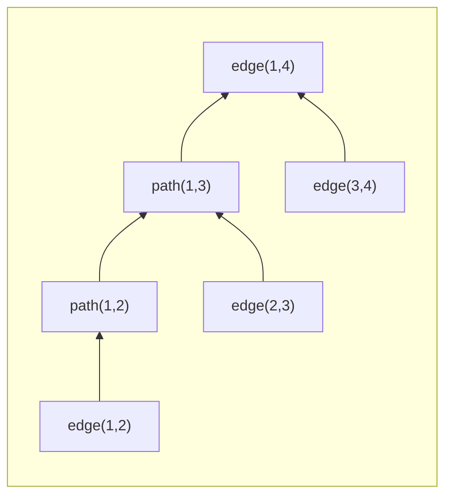
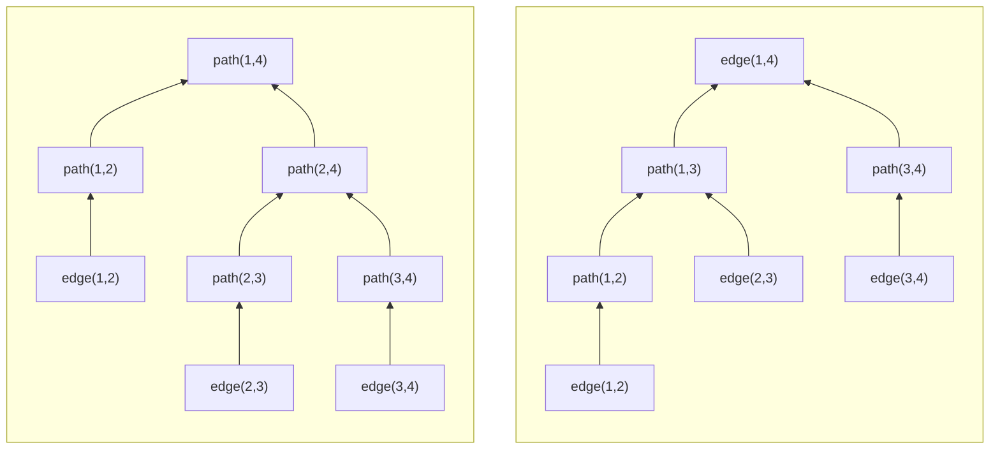
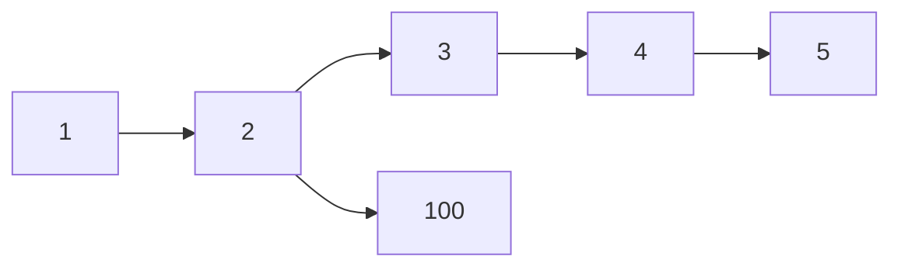
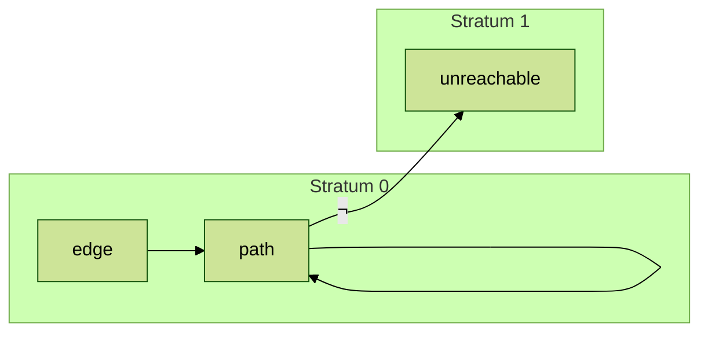

# Datalog

Datalog is an expressive declarative relational language with many powerful extensions. Because it is clean and powerful, it is often used in DB theory work, and is a good basis for developing new declarative languages. The syntax is very terse, however, and is not the easiest for humans to read.

Datalog came into being as a subset of Prolog, which was the original language of logic programming. Prolog is weird; it mixes declarative semantics with a specific imperative evaluation strategy that you have to understand. We will not discuss it further.

Because of its roots in logic programming, Datalog carries with it a lot of definitions and jargon from logic that we don't really need (or we can assume in casual conversation). If you find yourself reading a Datalog paper that has an opaque Background section talking about Herbrand Universes and whatnot, I encourage you to consult ChatGPT for a "plain English" discussion.

In fact, rather than diving into definitions,
I think it's better to start with the syntax and semantics at a high level; I'll try to keep the jargon at a minimum.

## First Example

To begin, here is a classic SQL query to find employees who make more than their managers, and its datalog equivalent. Assume the schema of the `emp` table is `(id, name, sal, mgr_id)`
```SQL
SELECT e.name, e.sal, m.name, m.sal
  FROM emp as e, emp as m
 WHERE e.mgr_id = m.id
   AND e.sal > m.sal;
```
```Prolog
out(En, Es, Mn, Ms) :- emp(Eid, En, Es, Em), emp(Em, Mn, Ms, Mm),
                       (Es > Ms).
```
Some initial notes on the Datalog:
- A datalog *program* is an unordered set of *rules*
- A datalog rule has a *head* and a *body*, separate by a deduction operator `:-`. You can read a datalog rule to say "if the body is true, we deduce that the head is also true."
- By convention, variables are capitalized, and constants are lowercase
- Datalog references columns by *position*, never by name. 
- Repeated variables correspond to implicit equality predicates; the repetition of `Em` in the datalog above is equivalent to the SQL predicate `e.mgr_id = m.id`.

[Hydro](https://hydro.run) is a Berkeley-based distributed systems compiler stack that, among other languages, supports a version of Datalog.
We have a Datalog parser live at the [Hydro playground](https://hydro.run/playground), which translates the datalog to dataflow graphs (query plans). We'll use it below, and note any idiosyncratic syntax. (To actually run the queries, you need to write a Rust program that embeds the Hydro Datalog syntax. More on that below.)

## The Syntax of Basic Datalog
```BNF
Program ::= Clause+ Query*
Clause ::= Fact | Rule
Fact ::= Predicate '.'
Rule ::= Predicate ':-' Body '.'
Body ::= Literal (',' Literal)*
Literal ::= Predicate
Predicate ::= Identifier '(' Arguments ')'
Arguments ::= Term (',' Term)*
Term ::= Identifier | Variable | Constant
Query ::= '?-' Predicate '.'
Identifier ::= letter (letter | digit)*
Variable ::= uppercase_letter (letter | digit)*
Constant ::= lowercase_letter (letter | digit)* | '"' any_character_except_double_quote '"'
```
A Datalog program is a (order-independent) set of clauses. A clause can be a "fact", which is like a tuple in the database. Here we define three facts in a binary relation:
```
edge(1,2).
edge(2,3).
edge(3,4).
```
> In Hydro's datalog, facts are input via the `.static` keyword and Rust vectors like so:
> ```
> .static edge `vec![(1, 2), (2, 3), (3,4)]`
> ```


A clause can also be a rule, which deduces new facts from known facts. Here is a simple rule that says that any fact in the `edge` relation is also in the `path` relation:
```
path(X, Y) :- edge(X, Y).
```
You can read that as "if there is a tuple `(X, Y)` in `edge`, there is a tuple `(X, Y)` in `path`. This is declarative, so you don't have to bother yourself asking "how" we populate `path`; we have simply stated a logical truth about `path`.

The *head* of a rule is on the lhs of `:-`; the *body* of a rule is on the rhs. The head is a single *predicate* (i.e. relation). The body is a *list* of predicates, separated by commas, representing the *conjunction* (AND) of the literals. 
> Variable scoping: The scope of a Datalog variable spans all the predicates in a single rule. Across rules, variables can be reused, and hence their positions in the same predicate can change across rules.

Here is a more interesting rule:
```
path(X, Y) :- path(X, Z), edge(Z, Y).
```
This rule is clearly *recursive*: the head and body have the same predicate. We can read it as recursively defining paths of increasing edge-length: there is a path from *X* to *Y* if there is a path from *X* to *Z* and an edge from *Z* to *Y*. Together, these two rules are like a base case and an inductive case in a definition:
```
-- transitive closure of edges in a graph
path(X, Y) :- edge(X, Y).
path(X, Y) :- path(X, Z), edge(Z, Y).
```
> OR: Note how we achieve disjunction in datalog: we simply have multiple rules with the same head predicate! That is, we capture disjunction as relational union: a fact is in `path` if it was deduced by the first rule *or* the second rule.

## EDB, IDB and Queries
Datalog partitions the set of predicates into those that are populated with given facts (the *Extensional* Database or EDB) and derived (the *Intensional* Database or IDB.)  Note the use of *s* in the spelling of those words. 
IDB predicates cannot appear in facts.
EDB predicates cannot appear in the head of rules.

Some versions of datalog allow a specific "query" syntax to be specified using the symbol `?-`.

Whether we use the `?-` symbol or not, our queries often want to "bind" certain variables to constants. For example, we might want to find all nodes reachable from node 0:
```
?- path(0, Y).
```

In Hydro's datalog, we declare queries as "output" predicates that pass the set of tuples to Rust iterators, like so:
```
.output out `for_each(|t| println("{:?}", t))`
out(Y) :- path(X, Y), (X == 0).
```

## Safety and Range Restriction
We want to ensure that our IDB is finite. This is called "safety" in Datalog terminology.

More terminology:
- The set of possible values we can assign to variables is called the *Domain* (**dom**) of the program
- The set of constants in the EDB is called the *Active Domain* (**adom**), or sometimes the *Herbrand Universe*.

To enforce safety, we impose the following constraint on Datalog rules:
> *Range Restriction:* Every variable in the head of the rule must appear in the body.

If we think of a rule as a function, the output (the "range") is restricted by the input (the "domain"). Hence "range restriction".

This ensures a simple semantics where the tuples in the head are based on bindings of variables in the body, which (recursively) are based on the active domain -- the values in the EDB.

The dependence on the active domain also gives us a starting point on theoretical bounds of output size (and hence runtime): if an IDB predicate has n attributes, it can be at most $|\textbf{adom}|^n$ big! This is useful when we talk about complexity theory.


## Simple extension: Function Symbols
In our SQL example at the top, we used a `<` predicate. Strictly speaking, Datalog has no such predicate. But we can imagine one, and most Datalog variants provide one.

The predicate `<` is a pre-populated set of pairs `<(X, Y)` such that the value `X` is lower than the value `Y`. This is just like an EDB predicate, except that it is infinite! Look back at our query:
```
out(En, Es, Mn, Ms) :- emp(Eid, En, Es, Em), emp(Em, Mn, Ms, Mm),
                       <(Ms, Es);
```
Writing the `<` relation in prefix notation this time, we see that "selection" predicates (filters) are nothing more than *joins with infinite relations*. That's cool, but it should worry you about safety again, e.g.:
```
?- <(0, X)
```
We would like safe Datalog, so we want to forbid this.

More generally, you can imagine defining any function you like as a predicate. For example, the predicate `+(X, Y, Z)` has all triples such that $X + Y = 0$. It also has a *functional dependency* $XY \rightarrow Z$. Similar to the example above, we don't want to allow a query like:
```
?- numbers(X), +(X, Y, Z).
```

We can avoid these problems by a variant of range restriction: we restrict function symbols to be used only when their domain columns (the lhs of the functional dependency) are bound by other predicates.

# Datalog Semantics: Model Theory
The declarative way to think about Datalog semantics is just by substituting ("binding") variables with *all possible constants* from the domain, and checking which substitutions are true.
That may sound crazy computationally, but it's a fine definition, and the one we get from our roots in logic. 

Now we're ready to define a semantics for function-free Datalog programs:

- An *interpretation* of a Datalog program is an assignment of values from the domain to variables of the program: essentially it is a database (both EDB and IDB).
- A *model* of a program is an interpretation such that:
    1. All facts in the program are true.
    2. All rules in the program are satisfied (if the body is satisfied, so is the head).
- A *minimal model* of a program is one such that no proper subset of the model is itself a model.

Why would we need to define minimal models? Well for one thing, it rules out the goofy non-minimal models. Let's go back to our transitive closure example:
```
edge(1,2).
edge(2,3).
edge(3,4).
path(X, Y) :- edge(X, Y).
path(X, Y) :- path(X, Z), edge(Z, Y).
```
Here is a correct model for that program:
```
edge(1,2).
edge(2,3).
edge(3,4).
path(1,2).
path(2,3).
path(3,4).
path(1,3).
path(2,4).
path(1,4).
path(1,100).
```
See that? The model includes a path from `1` to `100`. This does not contradict the program in any way, but it's kind of absurd, and certainly unsafe: we can posit any number of arbitrary paths *ad infinitum*. If we omit `path(1,100)` from the model above, you should be able to convince yourself that we have a minimal model. And here's a very cool thing:

> Theorem: Datalog programs have a unique minimal model.

This is cool! We now know what a Datalog program *means*, in a declarative sense: it is the unique minimal model.

The proof that there exists a model is easy: we'll see it when we look at how to evaluate Datalog, which we'll do next. The proof that it's unique also follows from the discussion of evaluation: if we derive an IDB fact in one minimal model, we can convince ourselves it will be derived in any other minimal model, hence all minimal models are the same.

## The Closed World Assumption
The *Closed World Assumption* asserts that *any statement not known to be true is false*. Some logics make the opposite, *Open World Assumption*, where statements may have unknown truth values.

Minimal models in basic Datalog embrace the closed world assumption. We'll return to this idea when we discuss negation below.

# Bottom-Up Datalog Evaluation
Now we need a way to compute the results of a Datalog program. We'll do this "bottom up", in the sense that we'll start with EDB facts and use relational algebra to compute IDB facts iteratively. (In old-school AI this is called "forward chaining" the rules.) Here's how it goes:

## Naive Evaluation
1. Initialize by asserting all facts in the EDB exist.
2. "Apply" each rule once in any order, asserting facts in the head by joining existing facts in the body. (All facts are accumulated in IDB relations via union). 
3. If any new facts were derived in (2), goto (1).

You should be able to convince yourself that naive evaluation will compute a model. 

### Fixpoint Terminology
If our program is called *P*, we say that the 2nd step above is an operator $IC(P)$, meaning the "immediate consequence" of $P$. Naive evaluation end at the *fixpoint* of the IC operator, $FP(IC(P))$ -- when iteration of IC generates no new information.

## Semi-Naive Evaluation
The problem with Naive evaluation is that it re-derives facts many times.

The next thing people made up was a little smarter; they called it "semi-naive evaluation". Turns out this is the best we can do (without rewriting the program further, which we may get to below).

Semi-naive evaluation can itself be seen as a program rewrite, along with some imperative control. In the rewrite, each IDB predicate generates three versions: the original version, a *delta* version, and a *new* version. Each rule is rewritten so we form all combinations of joins with original and delta versions. This is easiest to see with an example. Let's go back to edges and paths:

We initialize before the first iteration. We only have one IDB relation to initialize:
```prolog
path_new() = ∅.
path_delta() = ∅.
```

Now we rewrite the rules to use `path_new` in the head, and `path_delta` in the body (more on the body in a moment):
```prolog
path_new(X, Y) :- edge(X, Y).
path_new(X, Y) :- path_delta(X, Y), edge(X, Y).
```
Then at the end of each iteration we promote the delta facts to the *original* version, and the *new* facts to the *delta* version:
```
path(X, Y) :- path_delta(X, Y);
path_delta = path_new;
path_new = ∅;
```
You should be able to convince yourself that the $i$'th iteration (of $IC(P)$) uniquely derives all paths of length $i$!

In rules with multiple IDB predicates in the body, we have to be more careful: we want to join all new *delta* facts in one relation with *all* the facts in the other relations in the body, whether they be *delta* or *old*. That is, a new head fact can be derived by any one delta fact joining with any facts old or delta. To achieve this we rewrite each rule with *n* IDB relations into *2^n-1* rules (leaving out the one that just joins all old relations).  Here's a slightly different example that constructs paths differently:
```
path(X, Y) :- edge(X, Y).
path(X, Y) :- path(X, Z), path(Z, Y).
```
After delta rewriting it looks like this:
```
path(X, Y) :- edge(X, Y).
path(X, Y) :- path(X, Z), path_delta(Z, Y).
path(X, Y) :- path_delta(X, Z), path(Z, Y).
path(X, Y) :- path_delta(X, Z), path_delta(Z, Y).
```
As promised, we have 3 rules for 2 IDB predicates in the body. We have skipped only the naive rule, `path(X, Y) :- path(X, Z), path(Z, Y).`.

## Proof-Theoretic Semantics
There is a third way to look at Datalog programs: they are a way of constructing proofs of facts.

Here, a proof of an IDB fact A is a *proof tree*. Each vertex is a fact. The leaves are EDB facts. The root is A. The intermediate nodes are IDB facts derived from (a) the children facts  as substituted into (b) a rule in the program.

Here is a proof tree of the fact `path(1,4)` for our original edges and paths example:

This is basically like a derivation tree in a context-free grammar. 

Now look at our revised but equivalent example:
```prolog
path(X, Y) :- edge(X, Y).
path(X, Y) :- path(X, Z), path(Z, Y).
```
You should convince yourself that semi-naive evaluation constructs all distinct proof trees exactly once, but possibly derives certain facts multiple times via different proof trees:


You can view proof trees as tuple-level *data provenance* or *data lineage*. We can use this kind of reasoning in many ways, and we'll see some later this semester.

# Pipelined Semi-Naive Evaluation
Because basic datalog is monotonic, we can add in new EDB facts after a fixpoint is computed, and derive new IDB facts. Semi-naive evaluation can even ensure that we don't re-derive anything redunantly. This suggests that we should be able to implement a "stream" version of Datalog.

To do this without redundant computation, we just need to be a bit careful in our bookkeeping. The following scheme is a *pipelined semi-naive* (PSN) strategy that was developed here at Berkeley in our [Declarative Networking](https://dl.acm.org/doi/10.1145/1592761.1592785) work---Datalog applied to specifying, optimizing and implementing network protocols.

The basic idea is to assign a monotonically increasing sequence number to each tuple as it "arrives for processing" (either via input, or via recursive deduction). Then we modify semi-naive evaluation to simply join each tuple with all tuples that have lower sequence numbers. 

Note the distinction with semi-naive, which operators in a round-based fashion.  Consider the following edge set:
```
edge(1, 2).
edge(2, 3).
edge(3, 4).
edge(4, 5).
edge(2, 100).
```
which forms this graph:

Consider the query:
```
?- path(1, Y)
```
Semi-naive is defined to return paths of length one (`{(1,2)}`), followed by paths of length 2 ((`{(1,3), (1, 100)}`)), and so on.

Pipelined Semi-naive can tolerate a "delay" in the arrival of the fact `edge(2, 100)` and continue producing `(1,4)` and `(1,5)` without "waiting" for all 2-hop paths to be finished. 

Even if we have all the facts up front, an execution engine equipped with PSN need not traverse a graph breadth-first -- it can go depth-first, or really in any traversal priority desired (including a dynamic one!) Hence PSN can allow us to play tricks like pruning of cost-based traversals, which we'll discuss shortly.

# Negation, Stratification
We can extend datalog with negation on body predicates; this is sometimes called $\textrm{datalog}^\neg$ (pronounced "datalog neg"). In plain datalog, we essentially had existential quantifiers (the body of a rule is just a nested bunch of existence assertions.) Now we want to add universal quantifiers (a la SQL "ALL" subqueries), or DeMorgan-wise, negation of existential quantifiers (SQL's "NOT EXIST" subqueries).

This leads to *major* semantic confusion -- there are many semantics datalog programs with negation, more than one of which is at least vaguely reasonable. We will focus on only one, which is the most common and intuitive: *stratified negation.

For intuition, let's start with a simple case, where we only allow negation of EDB predicates.

## Semi-Positive Datalog
Semi-positive datalog is an extension to datalog in which we can use the negation symbol before EDB predicates in the body of rules. For example:
```
gap(X, Y) :- edge(X, _), edge(_, Y), !edge(X, Y).
```

- For safety (in the datalog sense of finite IDBs), we require the variables `X` and `Y` in the negated predicate to be bound by positive predicates. (The `_` symbol is syntactic sugar for "invent some unused variable"; it does not get unified/equijoined across predicates.)
- Because we have a finite EDB, and we are making the closed world assumption, we can treat *negation as failure*: if we cannot prove a fact is true, then it's false! Using this, we can easily enumerate the `!edge` bindings: it's $$not\_edge = \pi_1(edge) \times \pi_2(edge) - edge$$

And we can rewrite our query without negation:
```
gap(X, Y) :- edge(X, _), edge(_, Y), not_edge(X, Y)
```

In that sense, semi-positive datalog is "just datalog with preprocessing". 

(Side note: There is a seminal complexity result called the *Immerman-Vardi Theorem* that says that semi-positive datalog with a successor relation is equivalent to PSPACE! This was the first major result connecting logic programming to complexity, and kicked off the field of *descriptive complexity*. Neil Immerman and Moshe Vardi independently published this result; they both remain leaders in descriptive complexity.)

## Stratified Negation
Stratified datalog is essentially an extension of semi-positive datalog, but now we want to extend our use of "negation as failure" to enumerate a negated IDB. For example:
```
path(X, Y) :- edge(X, Y).
path(X, Y) :- path(X, Z), path(Z, Y).
unreachable(X, Y) :- edge(X, _), edge(_, Y), !path(X, Y).
```
Some notes on the example:
- The `unreachable` predicate is *non-monotonic*! If we add a new edge, we may cause a previously-true `unreachable` fact to become false.
- As a result, we do not want to assert the truth of the contents of `unreachable` until we have reached fixpoint on the contents of `path`!

Stratified negation ensures this last point: we (monotonically) "inflate" our positive `path` predicate to fixpoint, and only then define the contents of the negated predicate `!path`. In essence we have separated the program into two *layers* or *[strata](https://en.wikipedia.org/wiki/Stratum)*: before the negation, and after. 

> Note on English: singular of *strata* is *stratum*.

More generally, our program may have many negated predicates, so we may have many strata.  There is a simple algorithm to *stratify* a $datalog^\neg$ program. The key is to ensure that each negated IDB predicate is evaluated in a stratum higher than the predicates that it *depends on*.

To do this we simply construct a *Predicate Dependency Graph*, break it into strong components, and run monotonic datalog "stratum by stratum" in the resulting DAG. 
> Recall that any graph can be reduced to a DAG of [strongly connected components](https://en.wikipedia.org/wiki/Strongly_connected_component) (SCCs). All nodes in an SCC are pairwise reachable, which in our case means mutually recursive predicates. The graph of SCCs is by definition a DAG.

- Each node is a predicate in the program
- There is a (positive) edge $p \rightarrow q$ if $p$ appears in the body of a rule that has $q$ as its head.
- There is a (negative) edge $p \xrightarrow[]{\neg} q$ if $\neg p$ appears in the body of a rule that has $q$ as its head.
- Run the following pseudocode. 
```
SCCs = FindSCCs(G)
if SCC has a negative edge:
    return "cycle through negation: unstratifiable program"
strata = map.new()
current = 0
while exist SCCs not yet assigned to a stratum:
    for each SCC S not yet assigned:
        if all predecessors of S are assigned to a stratum:
            strata[current].append(S)
    current += 1

return strata
```

> Note that we reject programs with cycles through negation. These programs are effectively paradoxes -- they are equivalent to:
> $$ p :- \neg p$$
> We will talk more about this when we get to Dedalus!

The stratified semantics then treats the program as a series of semi-positive datalog program, in stratum order. Negated predicates are "sealed" and are effectively like EDB predicates in semi-positive datalog.

Here's the Predicate Dependency Graph for our links and paths example:


# Aggregation
It is natural to want to extend datalog with aggregation. SQL has aggregation functions in the `SELECT` clause, so analogously we can put these functions in the heads of datalog rules. We might take the following SQL query:

```sql
SELECT customer_id, year, sum(price)
  FROM receipts
 GROUP BY customer_id, year
```
and write it in datalog like so:
```prolog
total_sales(customer_id, year, sum<price>) :- receipts(product_id, category, customer_id, year, month, day, price)
```
The "group by" is implicit: all columns in the head that are not inside an aggregated function form the group by (composite) key.

But what about if we add another rule that find customers who spent exactly $1M in a year?
```prolog
million(customer_id, year) :- total_sales(customer_id, year, 1000000).
```
Note that this rule is non-monotonic: as we add more `receipts`, a tuple like `('taylor swift', 2022)` may be asserted as a true fact in `million` at some point, but then when Taylor buys one more thing that tuple becomes false. So in essence the tuple goes from `false` (before Taylor buys $1M of stuff) to `true` then back to `false`. Non-monotonic!

In this sense aggregation feels very much like negation, and we can treat it as such: we stratify before aggregations. Specifically, in our predicate dependency graph we say:
- There is a (negative) edge $p \xrightarrow[]{\neg} q$ if $p$ appears in the body of a rule that has $q$ as its head, and $p$ appears in the head of a rule containing that uses an aggregation function.

### Monotonic Aggregation and Monotonic Predicates
We can do better than this, and we will, when we talk about lattices in a few weeks in the context of $\textrm{Bloom}^L$. Here's the basic idea.

Consider an aggregate like `count<X>` or `sum<X>`. Clearly these grow monotonically. The problem we had above is that we tried to do equality checks on the result of these functions, and the equality predicate on a growing value is non-monotonic.

But what about a rule like this:
```prolog
million_up(customer_id, year) :- total_sales(customer_id, year, T), T > 1000000
```
This is monotonic! Once Taylor buys $1M worth of stuff, she is permanently in the `million_up` table. Clearly the monotonically growing order of `sum` is aligned with the order checked by `>`. 

This "monotonic alignment" complicates our aggregate stratification analysis. We'll return to this topic when we get to $\textrm{Bloom}^L$. Meanwhile, stratifying all aggregated predicates is (conservatively) correct.

### Aggregate Selection
Consider extending our running all-paths program to a "shortest paths" program. We'll need to keep track of the cost of each path between a given pair of nodes, as well as the specific path (a list of nodes) associated with that path.

To track paths, assume we have a function for concatenating two lists based on a bracket syntax `[l1, l2]` (a la lisp, but flattened -- no internal parens are key). Then we can write shortest paths like so:
```prolog
path(X,Y,[X,Y],C) :- edge(X,Y,C).
path(X,Y,P,C) :- path(X,Z,P1,C1), edge(Z,Y,C2), P = [P1,Y], C = C1 + C2.
shortest_path_len(X,Y,min<C>) :- path(X,Y,P,C).
shortest_path(X,Y,P,C) :- shortest_path_len(X,Y,C), path(X,Y,P,C).
```

Unfortunately, semi-naive evaluation doesn't do pruning along the way -- it will generate all paths between all pairs, then filter for shortest.

We can achieve pruning via a trick (due to work from Wisconsin in the 90s) called *aggregate selection*; it requires a bit of change to semi-naive evaluation. We introduce a notion of a selection set `s1` that we can add to our rules; the proposed syntax is:
```prolog
Selections s1 = path(X,Y,P,C) : groupby(path(X,Y,P,C),[X,Y],min(C))
```
and we have to know `s1` is applied to `path` (in the paper they rename `path` to `path\_s1` for that reason.)

Then at the end of each application of Immediate Consequence, we keep only the minimum-cost path for each `(X,Y)` pair.

This has the side benefit of avoiding enumerating infinitely many different-cost paths through a cycle!

### Connection to PSN, Graph Algorithms, Top-Down
Note that the combination of aggregate selection and PSN is quite nice. 

E.g. in finding a shortest path from `X` to `Y`, we can traverse in some way other than breadth-first. If we find *any* path from `X` to `Y`, we can add it to an aggregate selection set, and use its cost to prune out any paths whose cost is higher.

This should remind you of the `pruning` in Volcano/Cascades' top-down evaluation. In fact, we implemented top-down Volcano eval in the [Evita Raced](http://www.vldb.org/pvldb/vol1/1453978.pdf) optimizer (a datalog optimizer implemented in datalog, with PSN!)