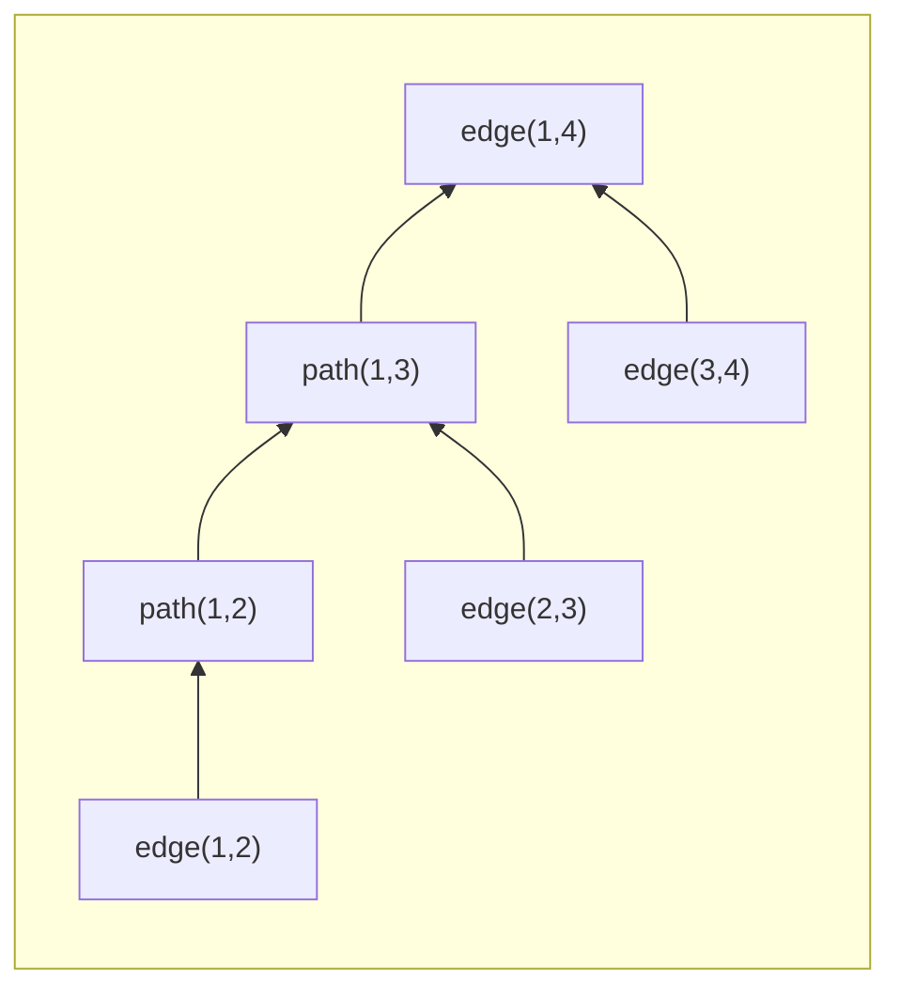
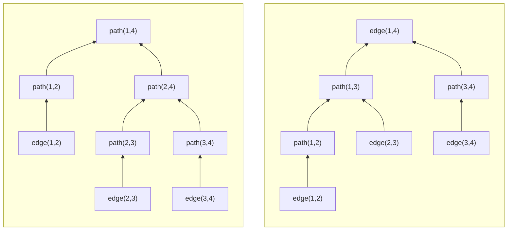
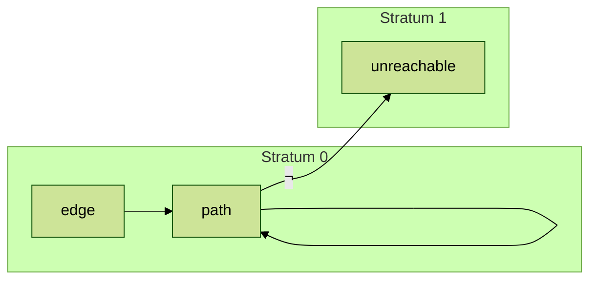

## First Example
```SQL
SELECT e.name, e.sal, m.name, m.sal
  FROM emp as e, emp as m
 WHERE e.mgr_id = m.id
   AND e.sal > m.sal;
```
```Prolog
out(En, Es, Mn, Ms) :- emp(Eid, En, Es, Em), emp(Em, Mn, Ms, Mm),
                       (Es > Ms).
```

---
## The Syntax of Basic Datalog
```BNF
Program ::= Clause+ Query*
Clause ::= Fact | Rule
Fact ::= Predicate '.'
Rule ::= Predicate ':-' Body '.'
Body ::= Literal (',' Literal)*
Literal ::= Predicate
Predicate ::= Identifier '(' Arguments ')'
Arguments ::= Term (',' Term)*
Term ::= Identifier | Variable | Constant
Query ::= '?-' Predicate '.'
Identifier ::= letter (letter | digit)*
Variable ::= uppercase_letter (letter | digit)*
Constant ::= lowercase_letter (letter | digit)* | '"' any_character_except_double_quote '"'
```

---
## Transitive Closure, Hydro.run Playground
```
 .static edge `vec![(1, 2), (2, 3), (3,4)]`
 .output out 
 .output out `for_each(|t| println("{:?}", t))`

-- transitive closure of edges in a graph
path(X, Y) :- edge(X, Y).
path(X, Y) :- path(X, Z), edge(Z, Y).
out(Y) :- path(X, Y), (X == 0).
```

---
## Semi-Naive Rewrite
Initialize:
```prolog
path_new() = ∅.
path_delta() = ∅.
```

While (not fixpoint):

1.
```
path_new(X, Y) :- edge(X, Y).
path_new(X, Y) :- path_delta(X, Y), edge(X, Y).
```

2.
```
path(X, Y) :- path_delta(X, Y);
path_delta = path_new;
path_new = ∅;
```

---
## Semi-Naive Rewrite 2
Before:
```
path(X, Y) :- edge(X, Y).
path(X, Y) :- path(X, Z), path(Z, Y).
```
After:
```
path(X, Y) :- edge(X, Y).
path(X, Y) :- path(X, Z), path_delta(Z, Y).
path(X, Y) :- path_delta(X, Z), path(Z, Y).
path(X, Y) :- path_delta(X, Z), path_delta(Z, Y).
```

---
## Proof Trees
Here is a proof tree of the fact `path(1,4)` for our original edges and paths example:



---
## Proof Trees 2



---
## Predicate Dependency Graph

