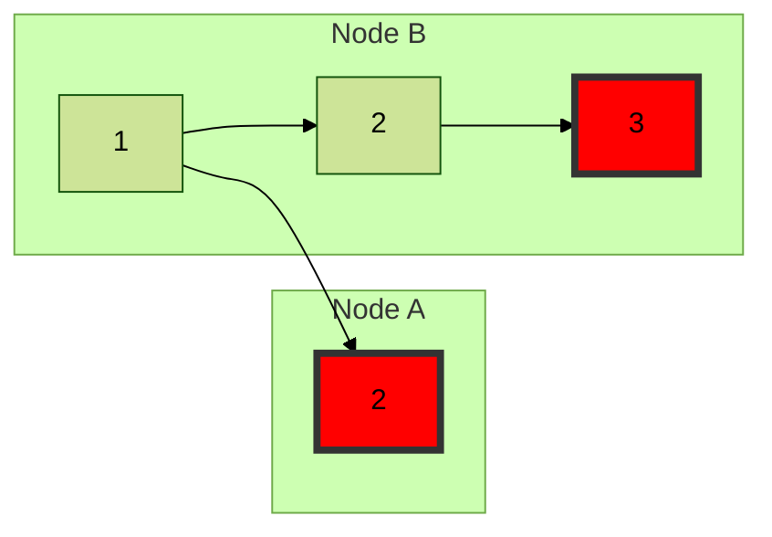
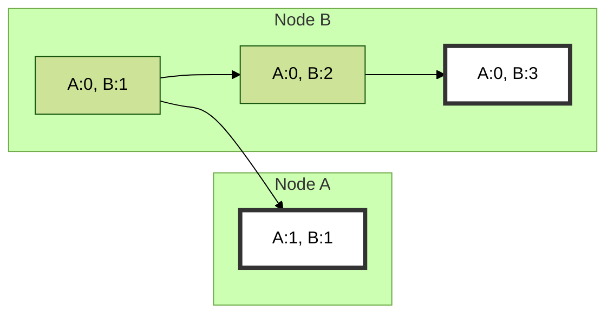

# Dedalus
Today's lecture is one of a few on my own group's ongoing work on declarative programming for distributed systems. This is a bit of self-indulgence, I confess. But I do think it's interesting, and I hope it will be useful in illuminating ways that database ideas like declarative languages can apply to new domains. At minimum you'll learn some distributed systems basics, and get a unique lens on that field. Also, I hope, it will give you a perspective on the potential of going deep into an area and sticking with it for a long time.

## Time in Distributed Systems
First, we'll start with some basics from distributed systems. It turns out that distributed systems are not mostly a problem of spatially distributed machines; they are mostly a problem of temporally-distributed machines. That is, problems arise because different machines cannot observe the state of the world *at the same time*. If you like a good slogan:

> Distributed Systems: It's About Time!

If you're a bit more pretentious, you can allude to General Relativity and Light Cones and whatnot. (But none of that is necessary or, in my admittedly Physics-poor experience, helpful.)

### Lamport time, Happens-Before, Causality
Lamport's classic [Time, Clocks, and the Ordering of Events in a Distributed System](https://lamport.azurewebsites.net/pubs/time-clocks.pdf) (1978)

- Lamport's happens-before relationship (and diagrams). 
    - Each "node" executes sequences of actions, one action "happens before" another in a *total order* per node.
    - Send and Receive are actions
    - Send at sender "happens before" Receive at receiver. Messages inherently induce *partial orders* across nodes. 
    - Take the union of "happens-before" precedences across all events across the system. This relation is a partial order (a DAG). *The transitive closure is called the happens-before relation*. 
- Happens-before is also called *causal* order.
    - Note that happens-before captures all data dependencies.
    - We assume no side-channels -- all messages are explicit.
    - We are conservative --- we assume that every single event that "happens before" an event could effect a cause on that event.
    - If the pairs $(e_1, e_2)$  and $(e_2, e_1)$ are not in the happens-before relation, they are called *concurrent* -- nobody can observe which event happened first.
- We can totally order the events in the system via a topological sort of the happens-before DAG. Note that concurrent operations are *arbitrarily* ordered ("ties are broken") in choosing a top-sort. 
    - Arbitrary does not mean random! We want agreement across nodes.
    - Nodes must agree on a deterministic tie-breaking scheme. In the limit this is pretty restrictive.


### Clocks
We *could* track causality dynamically by having every message drag along its antecedent message IDs. Usually rather expensive. Instead we'll use "clocks" in clever ways.

- We can assign monotonically increasing numbers (a total order) to each event at a given node. This is sometimes called a *logical clock*

#### Lamport Clock: Causality, Guaranteed
> A *Lamport Clock* is achieved by 3 rules:
    1. increment local clock before every event
    2. attach your local clock value on every message you send
    3. on message receipt:
        a. set your local clock to `MAX(local clock, message clock value) + 1`;
        b. increment your local clock
  
If $e_1$ *happens-before* $e_2$ then $e_1 < e_2$ in Lamport time. But the converse is not true. That is, Lamport time is a *superset* of the happens-before relation. It may report false positives of *happens-before*!



#### Vector Clock: Causality, Captured Exactly
What if we want to track happens-before precisely?

> A *Vector Clock* is achieved by having each node track the highest clock value they've heard about from every node. I.e. it's a hashmap `vc[nodeId => max(clock)]`. This hashmap is called a vector clock
    1. increment `vc[localId]` before every event
    2. attach `vc` on every message you send
    3. on message receipt with vc `vc_msg`
        a. increment `vc[localId]`
        b. for node in nodes
            `vc[node] = max(vc[node], vc_msg[node])`

Vector clocks capture happens-before precisely, at the cost of a hashmap as big as the number of nodes in the system. They allow us to compare two events and correctly decide if they were concurrent, or if one caused the other.



#### Matrix Clock: I Know What you Know (Knew)
Motivation: Consider a protocol where nodes forward received messages on to other nodes. Suppose, for purposes of reliability, you need to save a message $msg$ with a vector clock $vc_{msg}$ as long as there's some node that may not have heard it yet. 

In order to reclaim space safely, to delete $msg$ you'd need to know the vector clock $vc_n$ at *every other node $n$*, and check that $vc_{msg} < vc_{n}$. 

Said differently, you'd like to know (a lower bound on) what other nodes know. *Matrix clocks* are a way to do this.

A matrix clock is simply a set of vector clocks $vc_n$ for all participants $n$ in the network. We can stamp (some or all) messages with matrix clocks and update them with `max` much as we did with vector clocks.


## Dedalus
### Early Days: Declarative Networking
In work on [Declarative Networking](https://boonloo.cis.upenn.edu/papers/declarenet_cacm09.pdf) in the first decade of the 2000's, 
my group demonstrated that many networking ideas are well-represented as declarative queries over graphs. 

Network protocols deal at their core with computing and maintaining distributed state (e.g., routes, sessions, performance statistics) according to basic information locally available at each node (e.g., neigh- bor tables, link measurements, local clocks) while enforcing constraints such as local routing policies. Recursive query languages like datalog fit well, with some "distributed" extensions.

We went through two language designs:
- [NDlog](https://dl.acm.org/doi/10.1145/1142473.1142485) was our first language, focused on routing protocols. 
- [Overlog](https://dl.acm.org/doi/pdf/10.1145/1095810.1095818) was next, originally designed for "overlay networks" like distributed hash tables.

Both of these languages are similar to Datalog, extended with the idea that some attribute in each predicate is of the type `NetworkAddress`, and serves as a *location specifier*: a declarative label that says "this tuple should live at the node in this attribute". In that way it's a lot like Gamma or any parallel database: we "shard" the EDB on location specifiers, and "route" the IDB tuples according to the location specifiers. The runtimes for the languages had the responsibility of enforcing this "routing" --  they essentially cause the programs to send messages.

We built a few runtimes and showcase applications, including:
- [P2](https://p2.cs.berkeley.edu/), a fairly efficient runtime for Overlog written in C++. The most significant application written in P2 was an implementation of Chord, described in the [P2 paper]((https://dl.acm.org/doi/pdf/10.1145/1095810.1095818)). It was 47 rules long and fit on one page; the MIT reference implementation was thousands of lines of C++.
- [Jol](https://github.com/tcondie/jol), a Java-based runtime for Overlog. The most significant application written in Jol was a clone of the Hadoop File System and the Hadoop "master" node, as described in the [BOOM Analytics](https://dl.acm.org/doi/10.1145/1755913.1755937) paper. In addition to being compact, it 
    1. Allowed us to trivially shard the master node and its state
    2. Allowed us to implement Paxos concisely and replicate the master node for fault tolerance
    3. Easily interpose monitoring/logging on an existing program by simply adding rules.

### Problems
We ran into trouble with Overlog on a number of occasions, where programs did not do "what we expected". 

One problem arose implementing the [Symphony](https://www.usenix.org/publications/library/proceedings/usits03/tech/full_papers/manku/manku.pdf) distributed hash table. As I remember it, a part of Symphony's topology is that nodes randomly request "neighbors" to connect to, but if a node already has a threshold number of inbound neighbors it rejects the request. We were seeing weird race conditions where a node would reject a neighbor request even though it had not met the threshold.

We tried to fix this by changing the runtime, but that only broke other programs. We realized that the problem was our language semantics weren't clear. In particular, something was fishy around issues like aggregation, soft state, and racing messages in the network --- i.e. non-monotonic logic meets non-deterministic ordering of messages!

## Dedalus: Datalog in Time and Space
Dedalus was an effort to get a distributed language with non-deterministic message times, non-monotonic expressive power, and a clear, formal semantics. We got this right not by inventing a new language, but by leveraging decades of research on Datalog. In fact, Dedalus is literally a subset of $datalog^\neg$.

The key distinction with Overlog/NDlog was to carefully model *time*, not just space. After all, distributed systems are about time!

Intuitively, we can think of Dedalus as Datalog across space and time. That sounds fancy, but it's not a lot more than adding a big `GROUP BY location, time` clause to every rule. This is simple, clean and surprisingly expressive!

Dedalus is nothing more than a few syntactic restrictions on $datalog^\neg$. Namely:

1. **Space/Time Columns**: Each predicate has 2 distinguished columns at the far right, typically with the variables *L* and *T*: *L* is a *location specifier* (i.e. a nodeId), *T* is a local clock value (*time*). In essence, we're saying that every fact in a dedalus program is true at one point in space-time.
    - Note that the location specifier is very much like a hash-partitioning attribute in Gamma. We're saying that each fact "lives" on a particular node. 
    - If we want to replicate a fact, we create two "copies" with different $L$ attributes.

2. **Spatiotemporal Join Restriction**: In the rhs of a rule, we require that the same variable is used for location and time in all predicates. In essence we're saying that *two facts join only if they are true at the same time in the same place* -- i.e. they're in the same spatiotemporal GROUP, or they "rendezvous in space and time".

3. **Successor**: We assume a successor predicate `succ(s, t)` whose entries are pairs of positive integers that differ by 1. This will allow us to represent sequential logical time on a local node.

4. **Local Sequentiality**: In the head of a rule, if location variable is the same as in the body (a "local" rule), the time is allowed to be either 
    1. the same as in the body (*deduction*), or 
    2. the successor of the body variable (*induction* in time).

5. **Remote Asynchrony**: In the lhs of a rule, if location variable is not the same as the location variable in the body (a network message), the time must come from a special `choice` function:
    ```prolog
    head(C1, ..., Cn, L2, T2) :- p1(..., L, T), ..., pk(..., L2,..., L, T),
                                time(T2),
                                choice((C1, ..., Cn, L2, L, T), T2).
    ```
    - `time` is the domain of legal timestamps, for range restriction
    - think of `choice` as a *non-deterministically-chosen deterministic function* that maps from its first argument to its second. That is, it chooses a random value `T2` for each tuple in the head, capturing the idea that messages require an arbitrary delay to arrive. (But see the discussion of Causal Rewrites below.)

### Syntax Sugar
To make Dedalus look more like datalog, we'll introduce some syntax sugar.

First, rather than requiring the location specifier to be in the penultimate position, we require its variable to start with `#`. (There can be only one location specifier per predicate in a rule).

Second, we sugar the time attribute by omitting it in the body (since it's the same in all predicates), and annotating the head. There are only three cases to consider:

- ***Deductive Rules***: In rules where the head and body predicates have the same time and location variables, we just omit the time and location entirely. Note that these rules are effectively "reevaluated" at every location and time.
    ```p(X, Y, #L, T) :- q(X, Y, #L, T).``` (unsugared)
    ```p(X, Y, #L) :- q(X, Y, #L).``` (sugared)
- ***Inductive Rules (`@next`)***: In rules where the head and body predicates have the same location variables, and the head time is successor of the body time, we use the `@next` suffix:
    ```p(X, Y, #L, T2) :- q(X, Y, #L, T), succ(T, T2).``` (unsugared)
    ```p(X, Y, #L)@next :- q(X, Y).``` (sugared)
- ***Communication rules (`@async`)***: In rules where the head and body predicates differ, we use the `@async` suffix:
    ```prolog
    head(C1, ..., Cn, L2, T2) :- p1(..., L, T), ..., pk(..., L2,..., L, T),
                                time(T2),
                                choice((C1, ..., Cn, L2, L, T), T2).
    ```
    (unsugared)


    ```head(C1, ..., Cn, #L2)@async :- p1(..., #L), ..., pk(..., L2,..., #L).``` (sugared)

#### Example: Routing
Here is a little program that does Path-Vector routing, which is used in internet protocols.
```prolog
// send links to dest end
linkD(Src, #Dest, Cost)@async :- link(#Src,Dest,Cost).

// local path computation, send new paths back to src end
path(#Src,Dest,pSrc,Cost) :- link(#Src,Dest,Cost), Path=f_init(Src,Dest).
path()
path(#Src,Dest,Path,Cost)@async :- linkD(Src,#Nxt,Cost1), path(#Nxt,Dest,Path2,Cost2), Cost=Cost1+Cost2, Path=f_concatPath(Src,Path2).

# prune shortest paths at src end
spCost(#Src,Dest,min<Cost>) :- path(#Src,Dest,Path,Cost). 
shortestPath(#Src,Dest,Path,Cost) :- spCost(#Src,Dest,Cost), path(#Src,Dest,Path,Cost).
?- shortestPath(#Src,Dest,Path,Cost).
```


### Local Time and Storage
The discussion above should make you a little uncomfortable as regards information *persisting* over time.

- If I write down an EDB fact like `link(x, y, c, 1, here)`, do I also need to write down `link(x, y, c, 2, here)`, `link(x, y, c, 3, here)`, *ad nauseum*?
- What about derived IDB facts? Do they get "underived" when the EDB facts at the leaves of their proof trees disappear?

At a shallow level, the answers here are *"yes"*, so we need some better way to talk about persistence.

Well, one definition of the verb *persist* in Merriam-Webster's dictionary is:
> persist: to be insistent in the repetition or pressing of an utterance (such as a question or an opinion)

We can define persistence in Dedalus by a rule that persists data across time:
```prolog
p(...)@next :- p(...).
```
Thanks to the semantics of `@next`, we know it is the time just after this current time. This says that every fact in `p` will persist, uninterrupted, from the time it first appears *ad infinitum*. In old-school AI this is a solution to the [frame problem](https://en.wikipedia.org/wiki/Frame_problem). We'll call it a *persistence rule*.

The persistence rule above is nice if we want storage to accrue monotonically. What if we want to delete from storage over time? For any persistent predicate `p` we can introduce a predicate `p_del` with the same arity, which lets you declare facts you want deleted from `p_del`. The we gently rewrite the persitence rule:
```prolog
p(...)@next :- p(...), !p_del(...).
```
Note how this works: if you infer a fact is in `p_del` at time $t$, then it will no longer be in `p` as of time $t+1$. In essence, `p_del` *breaks the chain of induction* that was enforcing persistence of that fact.

## Stratification Over Time
> *Time is what keeps everything from happening at once.* 
— Ray Cummings, *The Girl in the Golden Atom*, 1922.

As an extension of $datalog^\neg$, Dedalus requires a semantics of negation. We will adopt the notion of stratified negation, with a twist.

For intuition, recall that cyclic dependencies through negation amount to a contradiction,
```prolog
p(A) :- !p(A)
```
This says that `p(A)` both exists and does not exist. We will forbid this in deductive Dedalus. 

However, we will *allow* cycles through negation *over time*:
```prolog
p(A)@next :- !p(A)
```
This says that `p(A)` toggles in and out of existence across timesteps. There is nothing contradictory about this. It is also easy to check statically on a Dedalus program by labeling edges in the Predicate Dependency Graph with `next` and `async`, and only rejecting programs that have PDG cycles that have *negation without `next` or `async`.

This should concern us from a semantics perspective, because this program cannot be stratified! But that's OK.
In fact, this is just an example of *local stratification* in Datalog, and an easy one that we can determine syntactically.

### Local Stratification in Datalog & Dedalus
Local Stratification is basically stratification analysis at the level of facts rather than rules.

In general, local stratification cannot be checked statically without knowing the EDB. The test for local stratification is as expensive as evaluation:

- *Instantiate* rules: i.e., substitute all
possible constants for variables, but reject instantiations that cause some EDB subgoal to be false.
    - Ground atom = atom with no variables. (I.e. a fact or derived fact).

1. Build dependency graph at the level of ground atoms by instantiating the rules.
2. Program + EDB is locally stratified iff there are no cycles through negation in dependency graph.

It is easy to show that Dedalus provides a locally stratified model, because *each fact can depend negatively only on facts from the past*, and hence there are no cycles through negation for the instantiated dependency graph!

## Causal Rewrite for Dedalus: Lamport Delay
In order to guarantee local stratification in Dedalus, we have to forbid facts from being "sent into the past" (at least if anything depends negatively on them!)

To do this, we will effectively rewrite input programs with a "Lamport clock delay" to ensure that the facts are persisted in a buffer until their intended Lamport-clock arrival time.

Consider a rule `p(A,B)@async :- q(A,B)`. We will rewrite it as follows to use a receive buffer `p_wait` for tuples "from the future". Note that we assume `p_wait` is a new predicate not used elsewhere in the program:
```
p_wait(A, B, N)@async :- q(A, B)@N.
p_wait(A, B, N)@next :- p_wait(A, B, N)@M, N ≥ M.
p(A, B)@next ← p_wait(A, B, N)@M, N < M.
```
This makes tuples from the future *invisible* to the rest of the rules of the program until the program "catches up" to them.

Note that we extended our syntax sugar here: we allowed timestamps to be visible in the body, and copied ("entangled") into non-timestamp tuples in the head. 

## A Model Theory for Dedalus
At the beginning I claimed that Dedalus has a clear semantics from Datalog. But which semantics of negation? Well... moderately fancy ones, unfortunately, but they have intuitive explanations. 

- The dependence on the non-deterministic `choose` function led us (via the work of [Sacca' and Zaniolo](https://dl.acm.org/doi/10.1145/298514.298572)) to the Stable Model semantics. This is a complicated (and fascinating) semantics for negation. The short version in our context is that we can rewrite `choose` as a rule that looks kind of like 
    ```prolog
    p(X, Y, Z) :- !p(A, B, C), A != X, B != Y, C != Z
    ```
    This says "a particular arbitrary tuple (X,Y,Z) is in the IDB for `p` **and not** any alternate choice!". Every possible choice that satisfies the functional dependency in the `choice` function represents an alternative stable model for the program. I.e. we use negation and stable models to pick one non-deterministic model.
- Because the only non-determinism in Dedalus is the arrival time of messages, the stable models correspond to *all possible traces of a run of the program*. This connects our model-theoretic semantics to our operational semantics!
- Note that persistence rules lead to infinite IDBs! Dedalus defines an [ultimate model](https://citeseerx.ist.psu.edu/document?repid=rep1&type=pdf&doi=850bc2643c5708919ba18707600287393f8f8df0): the facts that are *eventually always true* -- i.e. there are infinitely many of these facts that differ only in (consecutive) timestamps. Ultimate models are the projection of these facts to exclude the time attribute. 
- Ultimate models can be shown to be finite. 
- There is only one ultimate model of a Monotonic Dedalus program. (monotonic rules have *confluence* to a unique ultimate model!)
- We can rewrite Non-monotonic Dedalus programs to use "coordination" rules to achieve the equivalent of global stratification. The resulting programs are also confluent to a unique ultimate model. (But is this required?? See CALM!)

# Who Cares??!
Dedalus provides for distributed programming what Datalog provides for traditional programming: a formal language that can be implemented, analyzed, optimized and made efficient for many programs. It is fully declarative, in the sense that it has a model-theoretic semantics: the program is defined solely by a specification of its visible output (i.e. a model).

With Dedalus, we became able to pursue the agenda started in Declarative Networking on a strong foundation. This has led us to more pragmatic languages including [Bloom](https://bloom-lang.net) and [Hydroflow](https://hydro.run).

Frankly, Dedalus is still very "nichey", as the intersection of Datalog aficionados and Distributed Systems aficionados remains small. Sometimes being in a niche gives you unique powers though! See for example David Chu's upcoming SIGMOD paper [draft version here](https://github.com/rithvikp/autocomp/blob/master/benchmarks/vldb24/Automatic_Compartmentalization_tr.pdf) that can automatically and correctly refactor and shard complex protocols like Paxos to scale them out.

[Hydro](https://hydro.run) is our big bet that we can take ideas from Datalog, Gamma, and the like, and use them as a general purpose compiler stack for distributed, elastic programs. Hey, if autoscaling works for SQL, and it works for Datalog, then why not for everything!