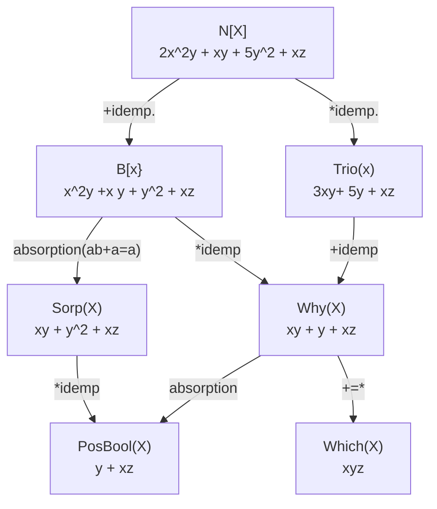

# Provenance Semirings
## Background on Data Provenance
There is a hodgepodge of papers on "data provenance" and "data lineage" in the late 1990's and 2000's, which was motivated by a variety of applications. 

> Data Lineage? Data Provenance? Val Tannen commented: "Lineage is for horses. Provenance is for art. So we prefer the term provenance".

Our paper today closed the book on the definitions of data provenance for monotone queries by finding a uniform algebraic framework in which they all sit. Moreover, the ideas in this paper can be used for "sidecar computations on queries" that aren't obviously data provenance applications.

The basic idea in data provenance is something like proof trees: we want explanations for answer tuples. This led to a bunch of different variations on provenance, which are well explained in [this survey paper](https://www.cs.ubc.ca/~rap/teaching/534P/2011/readings/provenance.pdf). A [later survey](https://www.cs.uic.edu/~bglavic/dbgroup/assets/pdfpubls/G21.pdf) goes into more depth on issues like negation, applications and implementation . 

Rather than learn them historically, we'll learn the algebraic framework and make sense of the earlier ideas.

> The basic idea here is super simple: we'll tag (annotate) every EDB tuple with some information. If the information follows the same mathematical rules as relational query processing, then the IDB tuples can have derived tags. Those mathematical rules come from semi-rings.

### Applications of Data Provenance
- Data integration/warehousing
    - Many data warehouses have data that has arrived via queries/transformations. It can be useful to record that provenance and query it.
    - When data comes from different sources, we may trust some more than others. 
- Regulatory
    - Explanations of query answers. Why is this tuple in the answer?
    - Right to be forgotten: if we delete a tuple, can we be sure that we've (correctly) deleted it from, say, a materialized view or published query result.
- Probabilistic databases
    - This was a hot and deep topic in the early 2000s: Can we capture data that is probabilistic? What does that mean for query processing?
    - Data lineage allows us to "carry" probabilities along in execution, so we can compute answer probabilities correctly. This is tricky (and in many cases intractable).
- Fault Testing
    - Suppose you have a protocol written declaratively.
    - Random (fuzz) testing is sampling from too big a space to test anything complex in the state space of the protocol
    - Instead, find proof trees for "good" outcomes, and induce faults that break those proofs
- Causality
    - E.g. Counterfactual cause: we want to know if a tuple $r$ in the answer will become false if we remove tuple $t$ in the database.
## Algebra Background
### Monoid
A Monoid is an algebraic structure: $(S, \times)$ satisfying the following axioms:

1. Associativity: $(x \times y) \times z = x \times (y \times z)$
2. Identity element: $\exists e \in G : \forall x \in G, x \times e = e$ and $e \times x = e.$

### Groups
A Group is an algebraic structure: $(G, \times)$ satisfying the following axioms:

1. Associativity: $(x \times y) \times z = x \times (y \times z)$
2. Identity element: $\exists e \in G : \forall x \in G, x \times e = e$ and $e \times x = e.$
3. Inverse element: $\forall a \in G \; \exists a^{-1} \in G : a \times a^{-1} = e$ and $a^{-1} \times a = e$. 

#### Abelian (Commutative) Groups
A Group is said to be *Commutative* or an *Abelian Group* (after algebraist Niels Henrik Abel) if it also satisfies:

4. Commutativity: $x \times y = y \times x$.

### Rings
A Ring is an algebraic structure: $(R, +, \times)$ satisfying the following axioms:

1. $(R, +)$ is an Abelian group. (We refer to $+$ as *addition*). The identity for addition is $0$.
2. $(R, \times$) is a monoid. (We refer to $\times$ as *multiplication*). The identity for multiplication is $1$.
3. Multiplication distributes over addition, i.e.
    - $a \times (b + c) = (a \times b) + (a \times c)$ for all a, b, c in R (left distributivity).
    - $(b + c) \times a = (b \times a) + (c \times a)$ for all a, b, c in R (right distributivity).

### Semi-Ring
tl;dr: A semi-ring is like ring, but $(R, +)$ is a commutative monoid -- i.e. there is no inverse for addition. 

Since this is our main structure, let's review here to be self-contained:

A Semi-ring is an algebraic structure: $(R, +, \times)$ satisfying the following axioms:

1. $(R, +)$ is a commutative monoid. (We refer to $+$ as *addition*). The identity for addition is $0$.
2. $(R, \times$) is a monoid. (We refer to $\times$ as *multiplication*). The identity for multiplication is $1$.
3. Multiplication distributes over addition, i.e.
    - $a \times (b + c) = (a \times b) + (a \times c)$ for all a, b, c in R (left distributivity).
    - $(b + c) \times a = (b \times a) + (c \times a)$ for all a, b, c in R (right distributivity).

### Commutative Semi-Ring
In a commutative semi-ring, both operations are commutative (monoids).

 
### Idea 1: K-Relations
Many previous notions of provenance rest on the idea that we keep an extra *annotation* attribute (or multiple) in each relation to calculate certain properties. 

Traditional set theory tags the (maybe infinite) universe of all tuples with True and False.

More generally, we define a *K-Relation*:
> Definition 3.1. Let $K$ be a set containing a distinguished element $0$. A *K-relation* over a finite set of attributes $U$ is a function $R : \textsf{U-Tup} \rightarrow K$ such that its *support*, defined by $supp(R) \stackrel{def}{=} \{t | R(t) \ne 0\}$, is finite.


### Idea 2: $RA^+$ on semirings
Now we define an extended relational algebra over K-relations, where *the annotations come from a semiring*. It turns out this behaves like relational algebra iff we choose semirings.


> Intuitively:
> -  the $+$ operator captures *alternative use* (union, projection)
> - the $\times$ operator captures *joint use* (join, cartesian product).
> - $0$ captures "absent" tuples, and $1$ is a "neutral" annotation. 


*As a running example, here assume the annotation is the* multiplicity *of a tuple -- how many times it should appear in the output in bag/multiset semantics. This follows the familiar definitions of addition and multiplication in an intuitive way.*

- union: $(R_1 \cup R_2)(t) \stackrel{def}{=} R_1(t) \textcolor{red}{+} R_2(t)$
- project: $(\pi_V R)(t) \stackrel{def}{=} \textcolor{red}{\sum}_{t = t' \, \textrm{on} \, V \, \textrm{and} \, R(t') \ne 0} R(t')$
- select: $(\sigma_PR)(t) \stackrel{def}{=} R(t) \textcolor{red}{\times} P(t)$
    - annotation unchanged when $P=1$
    - tuple absent when $P = 0$
- join: $(R_1 \bowtie R_2)(t) \stackrel{def}{=} R_1(\pi_{R_1} t) \textcolor{red}{\times} R_2(\pi_{R_2} t)$

If you take the semiring $(\mathbb{B}, \vee, \wedge, \textsf{false}, \textsf{true})$ this gives you good old relational algebra.

If you take the semiring $(\mathbb{N}, +, \times, 0, 1)$ (multiplicities) this gives you bag relational algebra.

> Note: Unlike traditional relational algebra, for K-relations union and (self-)join *are not idempotent*.

Consider datalog extended with a multiplicity attribute on each relation.
```prolog
side(potato, starch, 5).
side(bread, starch, 4).
side(caesar, salad, 3).
side(kale, salad, 4).
side(bread, salad, 3).
main(curry, 2).
main(burger, 4).

all_side(x, sum<mult>) :- side(x, _, mult), 
pairing(mname, sname, total_mult) 
    :- main(mname, mmult), all_side(sname, smult), total_mult = mmult * smult
pairing(mname, sname).

IDB:
all_side(potato, 5).
all_side(bread, 4+3).
all_side(caesar, 3).
all_side(kale, 4).
pairing(curry, potato, 2*5).
pairing(curry, bread, 2*(4+3)).
pairing(curry, caesar, 2*3).
pairing(curry, kale, 2*4).
pairing(burger, potato, 4*5).
pairing(burger, bread, 4*(4+3)).
pairing(burger, caesar, 4*3).
pairing(burger, kale, 4*4).
```

## Idea 3: Provenance Polynomials, Datalog
We can keep track of provenance at a fine grain using a *provenance polynomial*:

> Definition 4.1. Let $X$ be the set of tuple ids of a (usual) database instance $I$. The positive algebra provenance semiring for $I$ is the semiring of polynomials with variables (a.k.a. indeterminates) from $X$ and coefficients from $\mathbb{N}$, with the operations defined as usual: $(\mathbb{N}[X], +, \times, 0, 1)$.

This tells us which combinations (joins) of tuples were formed, and how many of each there are.

Going from RA+ to Datalog, a provenance polynomial of an IDB tuple in Datalog "sums up" all its proof trees, where each proof tree is a "product" of annotations. That is, the provenance polynomial is formed by taking the product of the annotations of the leaves of each tree, and summing across these trees. We may have inifinitely many distinct monomials, or infinitely large coefficients.  This can equivalently be described via a *power series*; see the paper.

(Much of the remainder of these slides cribbed directly from Val Tannen's very nice [Gems of PODS](https://www.cis.upenn.edu/~val/15MayPODS.pdf) talk!)

```prolog
sue_notes(cat, mouse, p).
sue_notes(cat, rat, q).
val_notes(mouse, gray, r).
val_notes(mouse, red, s).
val_notes(rat, gray, t).

out(x, z) :- sue(x, y), val(y, z).

IDB:
out(cat, gray, p*r+q*t)
out(cat, red, p*s)
```

Reading a provenance polynomial like $2r^2 + rs$:
- there are 2 derivations that use $r$ twice
- there is 1 derivation that uses $r$  onces and $s$ once


## We can specialize semirings beyond provenance!
### Specialize Provenance for Access Control
$(\mathbb{A}, min, max, 0, Pub)$ where $\mathbb{A} = Pub < Conf < Sec < TSec < 0$.

```prolog
sue_notes(cat, mouse, Pub).   % p
sue_notes(cat, rat, Pub).     % q
val_notes(mouse, gray, TSec). % r
val_notes(mouse, red, TSec).  % s
val_notes(rat, gray, Conf).   % t

out(x, z) :- sue(x, y), val(y, z).

IDB:
% out(cat, gray, p*r+q*t)
% = out(cat, gray, Pub*TSec + Pub*Conf)
% =
out(cat, gray, Conf)
% out(cat, red, p*s)
% = out(cat, red, Pub*TSec)
% =
out(cat, red, TSec)
```

## Specialize Provenance for Confidence Scores
$\mathbb{V} = ([0,1], max, \times, 0, 1)$, the Viterbi Semiring. Also used widely used in AI and signal processing for sequential (markovian) processes.

```prolog
sue_notes(cat, mouse, 0.9).  %p
sue_notes(cat, rat, 0.9).    %q
val_notes(mouse, gray, 0.6). %r
val_notes(mouse, red, 0.1).  %s
val_notes(rat, gray, 0.8).   %t

out(x, z) :- sue(x, y), val(y, z).

IDB:
% out(cat, gray, p*r+q*t)
% = out(cat, gray, max(0.9*0.6,  0.9*0.8))
% =
out(cat, gray, 0.72)
% out(cat, red, p*s)
% = out(cat, red, 0.9*0.1)
% =
out(cat, red, 0.09)
```
## Putting Prior Work in Context
Legacy Terminology:
- "Why Provenance": witnesses for the output tuple, without proof trees.
- "How Provenance": proof trees, etc.

Provenance semirings, e.g.,
- $(\mathbb{N}[X], +, ·, 0, 1)$ provenance polynomials [GKT07] 
- $(\textsf{Why}(X), \cup, \Cup, \emptyset, {\emptyset})$ witness why-provenance [BKT01]

Application semirings, e.g.,
- $(\mathbb{A}, min, max, 0, Pub)$ access control [FGT08]
    - E.g. assume Pub < Conf < Sec < TSec
- V = ([0,1], max, \times, 0, 1)$ Viterbi semiring (MPE) [GKIT07]

and some more:
- Binary Trust: $(\mathbb{B}, \wedge, \vee, \top, \bot)$
- $T = ([0, 1], min, +, \infty, 0)$ tropical semiring (shortest paths)
- $F = ([0,1], max, min, 0, 1)$ “fuzzy logic” semiring

## A Hierarchy of Provenance Semirings



Note: Each Downwards edge is a surjective semiring homomorphism, identity on X

## Extensions and Open Areas
- Queries with Negation & Aggregation:
  - This gets fancy. See, for example, Section 2.4 of the latter, [Glavic survey](https://www.cs.uic.edu/~bglavic/dbgroup/assets/pdfpubls/G21.pdf) cited above.
- "Why Not" provenance.

- The [Glavic survey](https://www.cs.uic.edu/~bglavic/dbgroup/assets/pdfpubls/G21.pdf) also discusses connections to topics outside databases:
    - PL: Data/control-flow analysis, Program Slicing, Symbolic Execution
    - Security: Taint Analysis
    - 

- Separately, semirings are used in a variety of other settings in CS and EE. As a result, people are increasingly exploring connections between query processing and topics like matrix multiplication, "message passing" algorithms in AI and EE (see the [Generalized Distributive Law](https://ieeexplore.ieee.org/document/825794))