# Background on Materialized Views
Views are good. Materialized views are even better! 

Mat views are to caching as CALM is SQL is to KVS.

There are really three core problems associated with this domain:

1. Choosing which matviews to materialize
2. Integrating matviews into query optimization
3. Incremental maintenance of matviews

And a related problem: Update through views.

# DBSP: A clean algebraic approach to MatView maintenance
[Extended version](https://github.com/vmware-archive/database-stream-processor/blob/main/doc/theory/main.pdf)

Idea #1: We want to support adding and deleting tuples from sets. Hence we need a language that allows us to "invert" things. **Groups** have inverses, and **Abelian Groups** obey the commutativity/associativity rules of sets. If we can define SQL and Datalog in terms of Abelian Groups, we're in business! (And of course we can cover other Abelian-group-like languages if you have any in mind!)

Idea #2 (borrowed): \mathbb{Z}-Relations or \mathbb{Z}-Sets, again from our provenance semiring friends at UPenn, Todd Green, Zach Ives and Val Tannen.  We can represent multisets via multiplicity provenance, and this makes a fine Abelian Group. Just need to worry a little bit about negative multiplicity!

## Background: Differential Dataflow
The background to DBSP is Frank McSherry's work on Differential Dataflow ("DD"), which underpins the Materialize startup. This line of work is notoriously hard to understand -- partly because it's complicated, partly because it might be over-complicated or just opaquely explained.

- The [first paper on DD in CIDR](https://www.cidrdb.org/cidr2013/Papers/CIDR13_Paper111.pdf) I recall as underspecified and vague; that's kind of OK for CIDR which is a "hot topics" venue that doesn't ask you to sweat the details. 
- There's an online [rustdoc book](https://timelydataflow.github.io/differential-dataflow/) that accompanies the open source. The last time I looked at it was before I learned Rust and I found it completely opaque. I should go back to it now and re-read.
- There's a [mathematical formalism paper](https://users.soe.ucsc.edu/~abadi/Papers/differential_revision-app.pdf) for differential dataflow, based on Mobius inversions. The earlier version I saw of this work seemed very opaque to me. The version I've linked here is a revision that highlights Abelian Groups and at a skim looks more approachable, but I haven't had time/inclination to work through it.

DBSP is touted as a somewhat limited but more completely automated model than DD, which is also extensible ("modular") -- see comments in Related work in the DBSP paper. Without having absorbed DD myself I won't say more other than I found the DBSP paper far more readable than my earlier attempts at reading about DD and talking with Frank.

## DBSP
Key formalisms: streams and operators.

In the intro, they introduce the notion of streams of data. They then go on to talk about streams of "transactions" not just data.  Heads up that this is unfortunate wording; there is *no discussion of serializability or other transactional semantics here*. What's meant is a stream of "updates" or "deltas", as opposed to raw data. We'll see how this is defined formally.

> A *stream* $\mathcal{S}_A$ is an indexed (numbered) sequence of elements of type $A$. Formally, a stream is a map from the integers to stream values, i.e. $\mathcal{S}_A \stackrel{def}{=} \{s | s: \mathbb{N} \rightarrow A\}$. $\mathcal{S}[t]$ is the value of stream $\mathcal{S}$ at "time" $t$.

> *Streaming operators* are functions that consume and produce (unbounded) streams. Formally, an $n$-ary stream operator is a function $T: \mathcal{S}_{A_0} \times ... \times \mathcal{S}_{A_{n-1}} \rightarrow \mathcal{S}_B$.

We'll largely use unary operators ($O: \mathcal{S}_A \rightarrow \mathcal{S}_B$), or binary operators ($O: \mathcal{S}_A \times \mathcal{S}_B \rightarrow \mathcal{S}_C$). 

We can write operators chains in functional notation, or draw dataflow diagrams in the spirit of query plans (the paper calls them circuits, which perhaps sounds more mathematical).

Sometimes we want to work with non-stream functions -- functions that take good old simple (scalar) arguments. But in order to bring them into our streaming model, we will "lift" them so they operate once per index (time point) in the stream:

> Given a scalar function $f: A \rightarrow B$ we define *lifting* it to a stream operator $\uparrow f: \mathcal{S}_A \rightarrow \mathcal{S}_B$ as $((\uparrow f)(s))[t] \stackrel{def}{=} f(s[t])$.

This extends naturally to functions of multiple arguments -- you simply eval the function on all the arguments each tick.

Rather obviously, *lifting distributes over function composition*: $\uparrow(f \circ g) = (\uparrow f) \circ (\uparrow f)$.

Now to the juicy bits.

> DBSP is only dealing with streams $\mathcal{S}_A$ where $A$ is an Abelian Group. As discussed above, this proves to be quite natural.

> The *delay operator* $z^{-1}$ does nothing more than return its input shifted left by one: 
$$z^{-1}(s)[t] \stackrel{def}{=} \left\{ \begin{array}{rcl}
  0_A & \textrm{when} & t = 0 \\
  s[t-1] & \textrm{when} & t > 0 
  \end{array} \right.
$$

This operator is borrowed from signal processing dataflow of the sort that our EE colleague Edward Lee is famous for. His latest language is [Lingua Franca](https://www.lf-lang.org/), which is targeted at real-time deterministic systems. It deserves a closer look than I've had time for to date. (Hydro and Lingua Franca students have begun talking but there's much to do.)

> DBSP is basically just lifted functions and delay!

### \mathbb{Z}-sets: Applying this to sets and bags
Given a set $A$, we define \mathbb{Z} over $A$ as functions $f: A \rightarrow \mathbb{Z}$ with finite "support" (as in our provenance discussion): i.e. $f(x) \ne 0$ for only a finite subset of $A$. Like a key-value map from $A$ to an integer. We refer to the values from $\mathbb{Z}$ as *weights*.

We'll use the notation $m[a]$ to mean the weight associated with object $a$ in $\mathbb{Z}$-set $\mathbb{Z}[A]$.

Note that unlike our provenance discussion of multisets, we are using $\mathbb{Z}$ not $\mathbb{N}$, so we'll allow weights to go below 0!

> A $\mathbb{Z}$-set is a *set* if the non-0 weights are always 1.

> A $\mathbb{Z}$-set is *positive* (a *multiset* or *bag*) if the non-0 weights are always positive.

> The function $distinct: \mathbb{Z}[A] \rightarrow \mathbb{Z}[A]$ converts a $\mathbb{Z}$-set into a set:
> $$distinct(m)[x] \stackrel{def}{=} \left\{ \begin{array}{rcl}
>  1 & \textrm{if} & m[x] > 0 \\
>  0 &  & \textrm{otherwise}
>  \end{array} \right.
>  $$

See Table 1 of the paper for $\mathbb{Z}$-set (i.e. abelian group) definitions of multisets a la SQL! Note how it's possible internally for the weights to go below zero (e.g. in the *difference* operator, but as far as the outside world can see it's all multisets!) thanks to the semantics of $distinct$.

### Some side definitions to ensure we're making sense
> An operator is *time invariant* (TI) if it commutes with delay. That is $

> An operator $F$ is *causal* if its output at time $t$ depends only on the values in the stream that *precede or include* time $t$. Formally, for all times $t$ and $\forall s, s' \in A$ we have: $(\forall i \le t .\; s[i] = s'[i] \implies F(s)[t] = F(s)[t'])$. *All DBSP ops are causal (including delay!)*

> An operator $F$ is *strict* if its output at time $t$ depends only on the values in the stream that *precede (and do not include)* time $t$. Same formalism as above but replace $i \le t$ with $i < t$! The delay operator is strict. Lifted operators are not strict (they depend on the current input)!

> A strict operator $F: \mathcal{S}_A \rightarrow \mathcal{S}_A$ has a unique fixpoint $F(\alpha) = \alpha \in \mathcal{S}_A$ denoted $\textrm{fix} \; \alpha.F(\alpha)$. 

Note that this definition of a fixpoint *is a stream*. Cosider the toggle operator $tog: \mathcal{S}_\mathbb{B} \rightarrow \mathcal{S}_\mathbb{B}$ where $tog(S[i]) = !tog(S[i-1])$. This is strict, and given a value for $S[0]$ has a unique "fixpoint" stream! This is a bit more flexible than the Dedalus notion of an ultimate model that has "eventually always" a single unchanging binding for each variable.

> If $F: \mathcal{S}_A \rightarrow \mathcal{S}_A$ is strict and $T: \mathcal{S}_A \times \mathcal{S}_A$ is causal, the operator $Q(s) = \textrm{fix} \; \alpha . T(s, F(\alpha))$ is both (a) well-defined and (b) causal.

### Back to the juicy stuff
> *Streams of abelian groups are abelian groups*: If you have an abelian group $A$, the structure you obtain by lifting the addition and inverses $(\mathcal{S}_A, +, 0, -)$ is also an abelian group.

So everything is closed: we can nest streams in streams in streams and its all abelian groups.

> A stream operator $S: \mathcal{S}_A \rightarrow \mathcal{S}_B$ is *linear* if it is a (group) homomorphism, i.e. $S(a + b) = S(a) + S(b)$. 

> A binary stream operator is *bilinear* if it distributes over addition, i.e. $\forall a,b,c . \; f(a+b, c) = f(a, c) + f(b, c)$ and $f(a, b+c) = f(a, b) + f(a, c)$.

That should be familiar from Bloom$^L$ and we'll use it similarly!

The "feedback loop" of a linear operator is linear.
Let $S$ be a unary, causal, LTI operator. Then the operator $Q(s) = \textrm{fix} \; \alpha . S(s + z^{-1}(\alpha))$ is well-defined and LTI.

```mermaid
%%{ init: { 'flowchart': { 'curve': 'stepBefore' } } }%%
flowchart LR
classDef blank fill:none,stroke-width:0px
s["s"]
s --> delay[z^-1]
s --> plus((+)) --> S
S --> delay
S --> alpha[⍺]
delay --> plus
class s,alpha blank;
```

> The *differentiation* operator  $\mathcal{D}_{\mathcal{S}_A}: \mathcal{S}_A \rightarrow \mathcal{S}_A$ is defined by 
$$\mathcal{D}_{\mathcal{S}_A} \stackrel{def}{=} s - z^{-1}(s)$$ or equivalently $s + (-z^{-1}s)$, which makes a nicer dataflow diagram.  $\mathcal{D}$ is LTI and causal.

If $s$ is a stream then $\mathcal{D}(s)$ is the *stream of changes* of $s$.

> The *integration* operator $\mathcal{I}_{\mathcal{S}_A}: \mathcal{S}_A \rightarrow \mathcal{S}_A$ is defined by
$$\mathcal{I}(s) \stackrel{def}{=} \lambda s . \textrm{fix} \; \alpha.(s + z^{-1}(\alpha))$. $\mathcal{I}$ is LTI and causal.  

Note how the integration operator is a loopy circuit, hence defined as a fixpoint! It is the sum of all previous points (i.e. the "discrete integral")!

> $\mathcal{I}(s)$ is the discrete (indefinite) integral applied to the stream $s$: $\mathcal{I}(s)[t] = \sum_{i \le t} s[i]$.

And now we're ready for the payoff:

> Given a unary stream operator $Q:\mathcal{S}_A \rightarrow \mathcal{S}_B$, we define the *incremental version* of $𝑄$ as: 
$$Q^\Delta \stackrel{def}{=} \mathcal{D} \circ Q \circ \mathcal{I}$$
> For an operator with multiple inputs we define the incremental version by applying $\mathcal{I}$ to each input independently: e.g. if $T: \mathcal{S}_A \times \mathcal{S}_B \rightarrow \mathcal{S}_C$, then $T^\Delta \stackrel{def}{=} \mathcal{D}(T(\mathcal{I}(a), \mathcal{I}(b)))$.

```mermaid
%%{ init: { 'flowchart': { 'curve': 'step' } } }%%
flowchart LR
classDef blank fill:none,stroke-width:0px
dels["Δs"] --> I -- s --> Q -- o --> D --> delo["Δo"]
class dels,delo blank;
```

> **KEY RESULT** (Proposition 3.2)
> - **inversion**: $ Q \mapsto Q^\Delta$ is bijective; its inverse is $𝑄 \mapsto I \circ 𝑄 \circ D$.
> - **invariance**: $+^\Delta =+, (𝑧^{-1})^\Delta = 𝑧^{-1}, −^\Delta = −, I^\Delta =I, D^\Delta = D$ 
> - **push/pull**: $𝑄 \circ I = I \circ 𝑄; D \circ 𝑄 = 𝑄 \circ D$
> - **chain**: $(𝑄1 \circ 𝑄2)^Delta = 𝑄1^Delta \circ 𝑄2^Delta$ (Generalizes to multiple inputs.)
> - **add**: $(𝑄1+𝑄2)^\Delta = 𝑄1^\Delta + 𝑄2^\Delta$
> - **cycle**: $(\lambda s. \textrm{fix} \; \alpha.T(s, z^{-1}(\alpha)))^\Delta = \lambda s.\textrm{fix} \; \alpha.T^\Delta(s, z^{-1}(\alpha))$

**chain**: the following two flows are equivalent, i.e. we can incrementalize a flow one op at a time:

```mermaid
%%{ init: { 'flowchart': { 'curve': 'step' } } }%%
flowchart LR
classDef blank fill:none,stroke-width:0px;

subgraph left[" "]
    direction LR
    i --> I --> Q1 --> Q2 --> D --> o
    class i,o blank;
end
equiv["≅"]
class equiv blank;
subgraph right[" "]
    direction LR
    ir[i] --> Q1r["Q1^Δ"] --> Q2r["Q2^Δ"] --> or[o]
    class i,o blank;
end
left --- equiv --- right
linkStyle 8,9 stroke:none;

```

**cycle**: the following two flows are equivalent, i.e. we can incrementalize a cycle by doing so within the cycle:

```mermaid
%%{ init: { 'flowchart': { 'curve': 'step' } } }%%
flowchart LR
classDef blank fill:none,stroke-width:0px
subgraph left[" "]
    direction LR
    s --> I --> T --> D --> o
    T --> delay[z^-1] --> T
    class s,o blank;
end
equiv["≅"]
class equiv blank;
subgraph right[" "]
    direction LR
    sr[s] --> Tdelta[T^Δ] --> or["o"]
    Tdelta --> delayr[z^-1] --> Tdelta
    class sr,or blank;
end
left --- equiv --- right
linkStyle 10,11 stroke:none;
```

#### Finishing up Incrementalization
The operators $+$, $-$ and $z^{-1}$ are identical to their incremental versions. More generally:

> Theorem 3.3 (linear): For an LTI operator $Q$ we have $Q^\Delta = Q$.

> Theorem 3.4 (bilinear): For a bilinear LTI operator $\times$ we have $(a \times b)^\Delta = a \times b + z^{-1}(\mathcal{I}(a)) \times b + a \times z^{-1}(\mathcal(b)) = \mathcal{I}(a) \times b + a \times z^{-1}(\mathcal{I}(b)).$

The bilinear case should be familiar to you as symmetric hashjoin (and non-recursive semi-naive evaluation!)

## Putting it all together
Now that we have differentiation and $\mathbb{Z}$-sets all worked out, we can do incremental view maintenance!

**Algorithm 4.6**:
1. Represent the query's relational algebra as a DBSP expression (circuit).
2. Apply rules to eliminate distinct
3. Lift the whole circuit (to handle a stream of deltas)
4. Incrementalize the circuit: surround it with $\mathbb{I}$ and $\mathbb{D}$
5. Apply chain rule recursively to get a circuit of incremental operators

Note on 2: Propositions 4.4 and 4.5 say how $distinct$ can be pushed, so that all queries can be rewritten correctly to have $distinct$ at the end.

See example in Section 4.5!

See Section 7 for handling aggregation (for abelian-group aggregates only!) 

### Recursive Queries
And it works for recursive queries too! This is quite a bit fancier. You might want to sit down with friends and work this through. See Equation 5.1: semi-naive evaluation!

> Open discussion point: I believe that DD can support the equivalent of pipelined semi-naive evaluation. Can DBSP do so as well?