```mermaid
flowchart TD
direction LR
classDef attr fill:#9f9,stroke:#333,stroke-width:2px;
classDef tuple fill:#f9f,stroke:#333,stroke-width:2px;

subgraph GFJ["Generic Free Join for Q♣"]
    direction BT
    subgraph prep[" "]
        Rgfj
    end
        Rgfj[R] --> RgfjIx{R}
    subgraph fora[" "]
        Rgfj --> gfj6[⨝_IX]
        RgfjIx --> gfj6 -- (x=>a) --> agfj((a))
    end
    subgraph forb[" "]
        Rgfj --> gfj2[⨝_IX]
        Sgfj[S] --> SgfjIx{S} --> gfj2 -- (x=>b) --> bgfj((b))
    end
    subgraph forc[" "]
        Rgfj --> gfj3[⨝_IX]
        Tgfj[T] --> TgfjIx{T} --> gfj3 -- (x=>c) --> cgfj((c))
    end
    agfj --> gfj4[⨝_MJ]
    bgfj --> gfj4
    gfj4 --> gfj5[⨝_MJ]
    cgfj  --> gfj5

    class agfj,bgfj,cgfj attr;
    class r,s,t attr;
end
subgraph BFJ["Binary Join for Q♣"]
    direction BT
    Rbfj[R] --> bfj4[⨝_IX] --> bfj5[⨝_IX]
    Sbfj[S] --> SbfjIx{S} --> bfj4
    Tbfj[T] --> TbfjIx{T} --> bfj5

    class a1,b1,c1 attr;
    class r1,s1,t1 attr;
end
subgraph FFJ["Factorized Free Join for Q♣"]
    direction BT
    subgraph prep2[" "]
        Rffj[R] --> ffj1[⨝_IX]
        Sffj[S] --> SffjIx{S} --> ffj1 -- ((x,a)=>b) --> s2((s))
        Rffj --> ffj2[⨝_IX]
        Tffj[T]  --> TffjIx{T} --> ffj2 -- ((x,a)=>c) --> t2((t))
    end
    s2 --> ffj3[⨝_MJ]
    t2 --> ffj3
    %% ffj3 --> ffj4[⨝_NL]
    %% t2 --> ffj4
    class s2,t2 attr;
end
```

# Free Join: A Practical WCOJ?
## The Big Idea
- Traditional query processing implements declarative queries (SQL/Datalog/etc) using binary join operators from relational algebra. 
- In principle, we *could* have n-way join operators.
    - The query processor (dataflow engine) doesn't mind
    - The query optimizer (a la Cascades) doesn't mind
    
- In fact, we saw this with eddies, esp. with SteMs/STAIRS.
    - That *is* an n-way join
    - And we had no real trouble hacking it into PostgreSQL

## WCOJ: NPRR
**Question:** Can n-way joins do better than binary joins? 

**Answer:** NPRR (Ngo, Porat, Re', Rudra, PODS 2012). Yes, sometimes! 
- Even better, they are *optimal* in a big-O (worst-case) sense
- Even in cases where *no sequence of binary joins is optimal*.

### Background: AGM
- How big can the output of an equi-join of 3 tables of size N be?
- AGM bound: Atserias, Grohe, Marx, FOCS 2008: tight bound *N^(3/2)* on output cardinality of a "full" conjunctive query (every column is in the output), given input cardinality *N*. 
- How bad can the output of a binary sub-join of 2 tables be? AHA!
    - We've seen that Yannakakis/LIP avoids this!
        - How well does it do??
    - But Yannakakis is only for "acyclic" queries
        - Acyclic queries have a rather technical definition. I like [Paris Koutris' lecture notes](https://pages.cs.wisc.edu/~paris/cs784-s22/schedule.html) (see lectures 4 and 5).)
    - For example, *The Triangle Query* is cyclic. More on this below.
- Is there an n-way join algorithm that achieves the bound in general?

### Evolution
- The NPRR paper was hard to read (Chris Re told me not to assign it to PhD students), and the constructive algorithm wasn't practical. 

- Coincidentally (??), Todd Veldhuizen at LogicBlox invented a very understandable join algorithm called Leapfrog Trie Join, and then realized (because he was hanging out with Hung Ngo?) that it is a WCOJ! 

- NPRR -> Leapfrog Trie Join --> Generic Join --> FreeJoin.
- We're on the road to clearing up this whole business. 
    - I think there's one or two more steps to go!

## Let's Revisit Binary join
- Start by assuming equijoin queries, with Hash Join implementation in memory
- Consider the query `R(a, b) ⨝ S(b, c)`, i.e.
```SQL
SELECT *
  FROM R, S
 WHERE R.b = S.b
```

Here is a standard "query plan" using binary joins and a Hashjoin-like scheme where we index the right relation on the fly (build a hashtable) and scan the left relation to probe the index. I like drawing query plans because they can be read either as (a) parse trees over collection types (relations), or (b) dataflow implementations that iterate over tuples. To me this is a nice middle-ground between declarative (SQL) and imperative (for loops).
```mermaid
flowchart TD
direction LR
  subgraph BJ["Binary Join"]
    direction BT
    R[R] --> j1[⨝_IX] --> j2[⨝_IX]
    S[S] --> SIx{S} -->j1
    T[T] --> TIx{T} --> j2
  end
end
```

## An Aside: Column Stores and Datalog Variables
In the late 1990s, early 2000s, the DB community got excited about optimizing big warehouse queries by storing tables 1 column per file ("columnar") rather than all columns in a file (row storage). Various benefits:

- Projection pushdown into storage (scan only columns you need)
- Easy to compress/decompress columnar storage (single data type)
- Easy to "vectorize" (i.e. batch) process in query plans:
  - a batch of column values fits in cache at once
  - no pointer-chasing or arithmetic to access a column within a tuple
  - We'll read more about this later in the semester

- Column-stores are typically viewed by an optimizer as as some kind of "materialized view" of a projection query. 
- The DB theory literature has lots of literature focusing on join *variables*, which are apparent in Datalog notation. Thinking at the level of variables rather than relations is used in PODS literature a lot, including Yannakakis and WCOJ.
    - `Output(x, y, z) :- R(x, y), S(y, x)` 
    - Equivalent to `SELECT * FROM R, S WHERE R.2 = S.1;`
    - `x`, `y`, `z` are "variables". Shared variables express equijoin. 
- The FreeJoin paper is the first I've seen to put these ideas together usefully!

## A nice, simple WCOJ: Generic Join
Generic Join is a WCOJ, meaning it reaches the inherent asymptotic complexity of producing the join (you can't do better in big-O terms). It's kind of like Yannakakis but it works for *any query*. 
- I'd like to connect Generic Join and Yannakakis directly. Didn't happen before today's lecture!

Generic join works by ordering the query *variables* rather than the *tables* in the query.

### An Aside: The Triangle Query
The simplest cyclic query is the "triangle" query: `R(x, y) ⨝ S(y, z) ⨝ T(x, z)`, i.e.
```SQL
SELECT *
  FROM R, S, T
 WHERE R.to = S.from
   AND S.to = T.from
   AND T.to = R.from
```

This is the general version of actually finding triangles in graph, which is the self-join version:
- `Edge(x, y) ⨝ Edge(y, z) ⨝ Edge(x, z)`, i.e.
```SQL
SELECT *
  FROM Edge AS R, Edge AS S, Edge AS T
 WHERE R.to = S.from
   AND S.to = T.from
   AND T.to = R.from
```

### Back to Generic Join
- Pick an order like `x, y, z`, and alternate phases of projection/intersection and lookup:
```python
for a in R.x ∩ T.x:
  r = R[a]; t = T[a]
  for b in r.y ∩ S.y:
    s = S[b]
    for x in s.z ∩ t.z:
        output(a, b, c)
```
- For our purposes below, let's use an `enumerate` to make the loop indexes explicit:
```python
for (i_x, a) in enumerate(R.x ∩ T.x):
  r = R[a]; t = T[a]
  for (i_y, b) in enumerate(r.y ∩ S.y):
    s = S[b]
    for (i_z, x) in enumerate(s.z ∩ t.z):
        # at loop index (i_x, i_y, i_z)
        output(a, b, c)
```

I prefer to think of this as dataflow. Obviously `∩` is a simple binary operator (a join algorithm). The array indexing (`S[a]`, etc) is literally Index Join of the loop variable values (bindings of `a`) with an index on another relation(`S`). Given that the loop variable is "a set of variable bindings", this is actually semi-join!

This gives us a "query plan" of binary operators, alternating between project/intersect and index join. The remaining trick is to put it together at the output, for which we may want to carry around our loop indexes. The pseudocode above doesn't need the loop indexes, it gets them "for free" via control-flow, but we can make the loop index explicit and do it via Merge Join. 
- Note: due to the extra loop indexes, intersect (`∩`) has to become semi-join.
- Might that be better than the for loops?!

```mermaid
flowchart TD
direction LR
classDef attr fill:#9f9,stroke:#333,stroke-width:2px;
classDef tuple fill:#f9f,stroke:#333,stroke-width:2px;
  subgraph GJ["Generic Join for QΔ"]
    direction BT
    subgraph Sub1["x bindings"]
        Rgj[R] --> p1["𝜋_x"] --> i1[∩]
        Tgj[T] --> p2[𝜋_x] --> i1
        i1 --> e1[enumerate] -- (i_x=>x) --> agj((a))
    end
    subgraph Sub2["semijoin on x bindings"]
        Rgj --> RgjIx{R}
        agj --> gj1[⨝_IX]
        RgjIx --> gj1 -- (i_x=>(x,y)) --> rgj(r)
        agj --> gj2[⨝_IX]
        Tgj --> TgjIx{T} --> gj2[⨝_IX] -- (i_x=>(x,z)) --> tgj(t)
    end
    subgraph Sub3["y bindings (filtered by x)"]
        rgj --> p3["𝜋_(i_x,y)"] --> i2[semijoin]
        Sgj[S] --> p4[𝜋_y] --> i2 
        i2 --> e2[enumerate_x] -- ((i_x, i_y)=>y) --> bgj((b))
    end
    subgraph Sub4["semijoins on y bindings"]
        bgj --> gj3[⨝_IX]
        Sgj --> SgjIx{S} --> gj3 -- ((i_x, i_y)=>(y,z)) --> sgj(s)
    end
    subgraph Sub5["z bindings (filtered by x, y)"]
        sgj --> p5[𝜋_z] -- ((i_x, i_y)=>z) --> i3[semijoin]
        tgj -- (i_x, z) --> p6[𝜋_z] --> i3 
        i3 --> e3[enumerate] --> cgj((c))
    end
    agj -- (i_x=>x) --> align[⨝_MJ]
    bgj -- ((i_x, i_y)=>y) --> align
    cgj -- ((i_x, i_y)=>z) --> align
    class agj,bgj,cgj attr;
    class r,s,t tuple;
  end
```





## FreeJoin
Note some funky things above:
- The pseudocode kept "projecting" in order to intersect (`a = R.x ∩ T.x`, etc.), and then "rejoining" via array index (`T[a]`, etc).
- In the dataflow version, we had to carry around the enumerated loop indexes counters (`i_x`, etc) to emulate the for loop indexes.
- Can't we keep the right variable around as we go? 
    - FreeJoin does this.

### Aside: Generalized Hash Trie: Column Stores meet Hashtables
- Consider table R(x, y). 
- We could store the column `R.x`, an array of distinct `x` values.
- We could do the same for `R.y`, which is ordered to zip with `R.x`
    - That is, `R.y[k]` is the `y` value associated with `R.x[k]`
- *OR* we could have the `R.x` be a hashmap from `x` to a range of offsets in `R.y`
    - *or* no need for `R.y` file, store the `R.y` subarray for each `x` in its own location
- Do this recursively for some column ordering, gives you a hash-trie
    - For SQL, the rightmost column is a hashmap from `x` value to multiplicity (# of dups of that tuple)
- *This looks awfully like our `enumerate`d loop indexes above!!

### FreeJoin Plan
Generalize binary and generic joins!
- A list of lists like `[[R(x),S(x),T(x)], [R(a)], [S(b)], [T(x)]]`
- Inner list is called a "node"
    - Consists of "subatoms", i.e. single-table projections
- Constraints:
    1. Subatoms in a FreeJoin plan form a *partition* of the attributes of each table
    2. First element of a "node" must be a *cover*
        - it contains all variables to the right of that node *that do not appear in previous nodes*
        - think of a cover as a set of variables that joins two subqueries
            - the previous nodes are a subquery
            - the remaining subatoms in this node are a subquery
            - the cover ensures we don't have a cross-product
        - because we have covers, we will not need `enumerate`d loop indexes!

Execution is a recursive algorithm. 
- Hold that thought -- we'll look at dataflow versions below.

### Optimizing a FreeJoin Plan

`binary2fj(bin_plan)`:

- current_node = [leftmost table]
- for each inner table X in the binary plan:
    - for previously-bound attrs [a] of X, form X.[a] and append to current node
    - add current_node to plan
    - current_node = [X - X.[a]]

To optimize, pass information sideways!
    - i.e. pull any probeable subgoals into earlier nodes
    - need to rethink the GHTs as a result

COLT: Column-Oriented Lazy Trie
    - all columns stored separately, as in columnstore
    - *OUT OF TIME TO PREP*

- **Open discussion!**

First, let's look at a new query, the "clover" query: `Q♣(x,a,b,c) = R(x, a), S(x, b), T(x, c)`, i.e.:
```SQL
SELECT *
  FROM R, S, T
 WHERE R.1 = S.1
   AND S.1 = T.1
```



